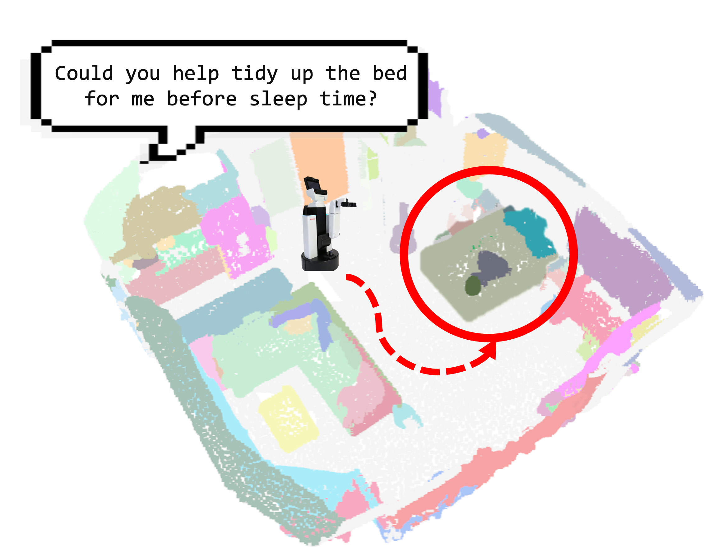
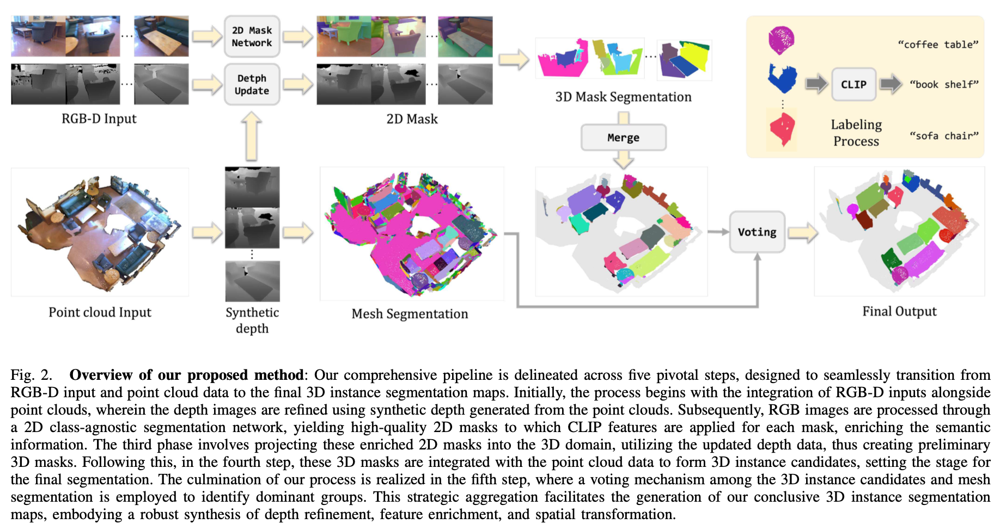

# OV-MAP : Open-Vocabulary Zero-Shot 3D Instance Segmentation Map for Robots
- Institutes: Seoul National University
  


---

## Abstract
This paper introduces a groundbreaking approach to open-world 3D navigation for mobile robots, leveraging the integration of open-features into the 3D map to enhance capabilities in navigation. We address the challenges of creating zero-shot 3D scene mappings in open-world environments, hindered by the scarcity of extensive open-world 3D datasets and the limitations of current methodologies that result in `feature flooding'. Our novel strategy employs a per-instance feature to 3D instance mapping technique, utilizing a class-agnostic segmentation model to project 2D masks into the 3D space. This process, combined with a 3D mask voting mechanism, allows for the generation of zero-shot 3D instance segmented maps without reliance on supervised learning models, enabling more accurate and adaptable open-vocabulary 3D mapping.
We validate our approach through extensive experiments on publicly available datasets such as ScanNet200 and Replica, demonstrating superior zero-shot performance and effectiveness in diverse environments. Additionally, we extend our evaluation to navigation tasks, showcasing significant improvements in navigation success rates through per-instance querying. Our real-world experiments further attest to the method's adaptability and robustness, proving its potential for widespread application in various environments.

---

## Method Overview


---

## Installation

### Step 1: Create Conda Environment
```bash
conda create -n ovmap python=3.8 -y
conda activate ovmap
```

### Step 2: Install Required Libraries
#### Install Required Libraries
```bash
conda install pytorch==1.11.0 torchvision==0.12.0 torchaudio==0.11.0 cudatoolkit=11.3 -c pytorch -y
conda install plyfile -c conda-forge -y
pip install -r requirements.txt
pip install git+https://github.com/facebookresearch/segment-anything.git
```
#### Install CUDA (if local cuda is not available)
```bash
conda install nvidia/label/cuda-11.3.1::cuda -y
```

### Step 3: Compile PointOps
#### Usual
```bash
cd libs/pointops
python setup.py install
cd ..
```
#### Docker & Multi GPU Arch 
e.g. RTX 3090TI=8.6, RTX 8000=7.5, A100=8.0, H100=9.0   
More available in: https://developer.nvidia.com/cuda-gpus
```bash
cd libs/pointops
# TORCH_CUDA_ARCH_LIST="ARCH LIST" python setup.py install
TORCH_CUDA_ARCH_LIST="8.6" python  setup.py install
cd ..
```

### Step 4: Install Detectron2
```bash
git clone https://github.com/facebookresearch/detectron2.git
python -m pip install -e detectron2
```

### Step 5: Install Open Query
```bash
pip install git+https://github.com/openai/CLIP.git@a9b1bf5920416aaeaec965c25dd9e8f98c864f16 --no-deps
```

### Step 6: Additional Setup
```bash
cp -r CropFormer detectron2/projects
cd detectron2/projects/CropFormer/entity_api/PythonAPI
make
cd ../..
cd mask2former/modeling/pixel_decoder/ops
sh make.sh
```

### Step 7: Install Other Packages
```bash
pip install numba==0.58.1 open_clip_torch==2.24.0 pillow==9.3.0
pip install -U openmim
mim install mmcv
```


## Acknowledgements
OVMap is based by the following repos: [Segment Anything](https://github.com/facebookresearch/segment-anything), [Pointcept](https://github.com/Pointcept/Pointcept), [SAM3D](https://github.com/Pointcept/SegmentAnything3D), [CropFormer](https://github.com/qqlu/Entity/tree/main), [OpenMask3d](https://github.com/OpenMask3D/openmask3d).
